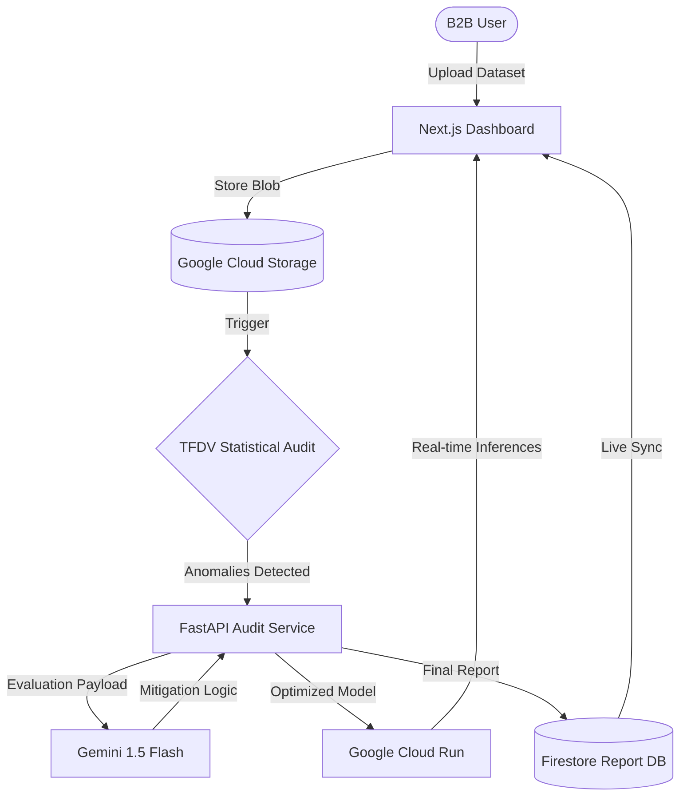

# 🏗️ Scalable Enterprise Architecture

This document outlines the professional-grade, cloud-native architecture for the Truth & Fairness AI Engine. Designed for absolute scale, high-frequency auditing, and robust governance, the platform leverages the full Google Cloud ecosystem.

## 🗺️ Data Lifecycle Pipeline

The following flow represents the "Phase 3" production pipeline, transitioning from local microservices to a fully managed serverless environment.

---

## 🚀 Architectural Layers

### 1. Frontend: The Visualization Layer
*   **Next.js 15 & Tailwind CSS**: Deployed via **Firebase Hosting**. 
*   **Google LIT Components**: Integrated specifically for bias heatmapping and counterfactual "What-If" analysis.
*   **Real-time Observability**: Direct subscription to **Firestore** updates ensures audit reports appear as soon as the backend processing completes.

### 2. Backend: The Serverless Grid
*   **FastAPI Microservices**: Each audit module (Mitigate, Audit, Diagnostics, Monitor) is containerized and hosted on **Google Cloud Run**.
*   **Auto-scaling**: The infrastructure scales from zero to hundreds of concurrent audits without manual intervention.

### 3. Intelligence: The Reasoning Engine
*   **Gemini 1.5 Flash**: Acts as the qualitative reasoning layer. It translates complex mathematical disparate impact ratios into actionable, human-readable mitigation strategies for compliance officers.
*   **TFDV (TensorFlow Data Validation)**: Integrated into the TFX (TensorFlow Extended) pipeline to provide schema-based data auditing at scale.

### 4. Persistence: The Historical Audit Store
*   **Firestore**: A NoSQL document store that tracks an organization's "Bias Improvement Score" over time.
*   **Audit Trail**: Every transaction, change in threshold, and Gemini-suggested mitigation is logged for legal defensibility.
